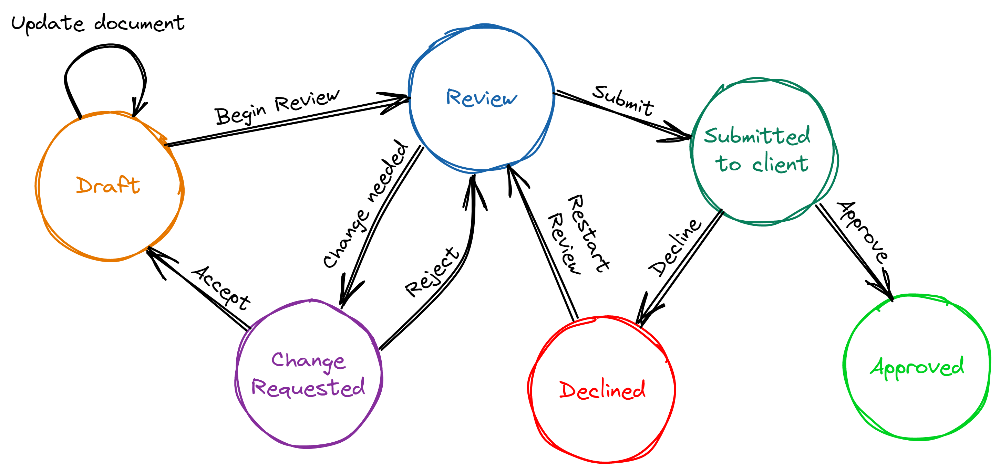

# Simple Finite State Machine using Stateless
Taken from: https://www.lloydatkinson.net/posts/2022/modelling-workflows-with-finite-state-machines-in-dotnet

Build on to of: Stateless, https://github.com/dotnet-state-machine/stateless

